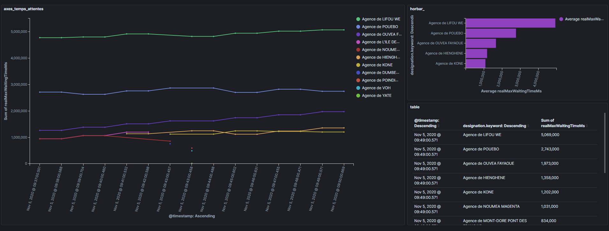
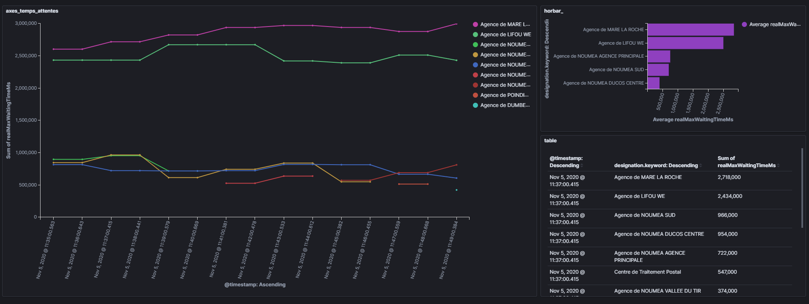

# opt-temps-attente-elk

* [Description](#speech_balloon-description)
* [Prérequis](#books-prérequis)
* [Utilisation](#rocket-utilisation)
  * [API](#api)
  * [ELK](#elk)
    * [Logstash](#logstash)
    * [Kibana](#kibana)
      * [Création de l'Index Pattern](#création-de-lindex-pattern)
      * [Dashboards](#dashboards)
    * [Stopper la suite Elastic](#stopper-la-suite-elastic)
* [Liens utiles](#liens-utiles)
  * [Aides/guides](#aidesguides)
  * [Résolutions](#résolutions)

## :speech_balloon: Description

Reporting ELK des temps d'attente des agences.

L'ambition de cette repo est de fournir une solution de reporting complète et totalement conteneurisée pour effectuer un reporting des temps d'attente en agence.

L'objectif principale est d'apprendre à:

* Dockerizer une solution
* Créer un déploiement K8S

## :books: Prérequis

Lancer l'API : [opt-temps-attente-agences-api](https://github.com/adriens/opt-temps-attente-agences-api) par le moyen que vous aurez choisi (`docker`, `mvn`, etc.). L'utilisation de ce projet nécessite l'installation des outils suivants :

* [git](https://git-scm.com/downloads)
* [Docker](https://www.docker.com/get-started)
* [docker-compose](https://docs.docker.com/compose/install/)
* *(Facultatif)* Un client REST tel que [Postman](https://www.postman.com/downloads/) ou [Insomnia](https://insomnia.rest/)

## :rocket: Utilisation

Récupérer le projet :

```bash
git clone https://github.com/adriens/opt-temps-attente-agences-elk.git
```

```bash
cd opt-temps-attente-agences-elk
```

### API

Test si l'**API** est *up and running*, par exemple :

```console
$ curl -GET http://localhost:8081/temps-attente/agences | jq
  % Total    % Received % Xferd  Average Speed   Time    Time     Time  Current
                                 Dload  Upload   Total   Spent    Left  Speed
100 12818    0 12818    0     0  12818      0 --:--:-- --:--:-- --:--:-- 21579
[
  {
    "idAgence": 9502,
    "designation": "TOMO SERVICES",
    "realMaxWaitingTimeMs": 0,
    "coordonneeX": 414695.3241999969,
    "coordonneeY": 249399.27869999968,
    "coordonneeXPrecise": 0,
    "coordonneeYPrecise": 0
  },
  [...]
  {
    "idAgence": 4310,
    "designation": "Agence de MOINDOU",
    "realMaxWaitingTimeMs": 0,
    "coordonneeX": 367105.9452000037,
    "coordonneeY": 278873.54089999944,
    "coordonneeXPrecise": 366555,
    "coordonneeYPrecise": 278703
  }
]
```

:bulb: Ou à l'aide d'un client REST ([Postman](https://www.postman.com/downloads/) ou [Insomnia](https://insomnia.rest/))

### ELK

Adapter l'url de l'api dans la configuration logstash `logstash\pipeline\logstash-waiting-time.conf` :

```properties
...
    urls => {
      waiting_time => {
        url => "<url>/temps-attente/agences"
        method => get
        tags => waiting_time
        headers => {
          Accept => "application/json"
        }
      }
    }
...
```

Démarrer la suite Elastic complète :

```console
$ docker-compose --project-name opt-temps-attente-agences-elk -f elk.yml up -d
Starting elasticsearch-opt-temps-attente-agences ... done
Starting kibana-opt-temps-attente-agences        ... done
Starting logstash-opt-temps-attente-agences      ... done
```

```console
$ docker-compose -f elk.yml ps
                 Name                                Command               State                Ports
-------------------------------------------------------------------------------------------------------------------
elasticsearch-opt-temps-attente-agences   /tini -- /usr/local/bin/do ...   Up      0.0.0.0:9200->9200/tcp, 9300/tcp
kibana-opt-temps-attente-agences          /usr/local/bin/dumb-init - ...   Up      0.0.0.0:5601->5601/tcp
logstash-opt-temps-attente-agences        /usr/local/bin/docker-entr ...   Up      5044/tcp, 9600/tcp
```

#### Logstash

On peut vérifier dans les logs si `logstash` a complètement démarré :

```console
$ docker logs logstash-opt-temps-attente-agences -f
...
[INFO ] 2020-11-05 04:11:12.334 [[waiting-time]-pipeline-manager] javapipeline - Pipeline Java execution initialization time {"seconds"=>0.99}
[INFO ] 2020-11-05 04:11:12.341 [[waiting-time]-pipeline-manager] http_poller - Registering http_poller Input {:type=>nil, :schedule=>{"cron"=>"* * * * * UTC"}, :timeout=>nil}
[INFO ] 2020-11-05 04:11:12.342 [[waiting-time]-pipeline-manager] javapipeline - Pipeline started {"pipeline.id"=>"waiting-time"}
[INFO ] 2020-11-05 04:11:12.383 [Agent thread] agent - Pipelines running {:count=>1, :running_pipelines=>[:"waiting-time"], :non_running_pipelines=>[]}
[INFO ] 2020-11-05 04:11:12.547 [Api Webserver] agent - Successfully started Logstash API endpoint {:port=>9600}
...
```

`stdout` d'exemple suite à un appel à l'api :

```properties
{
      "coordonneeYPrecise" => 360314,
             "coordonneeY" => 360315.82239999995,
                "idAgence" => 4326,
                "@version" => "1",
    "realMaxWaitingTimeMs" => 0,
             "designation" => "Agence de VOH",
      "coordonneeXPrecise" => 263706,
              "@timestamp" => 2020-11-05T04:12:01.571Z,
             "coordonneeX" => 263699.49930000305,
    "http_poller_metadata" => {
                 "request" => {
            "headers" => {
                "Accept" => "application/json"
            },
                "url" => "http://192.168.67.181:8081/temps-attente/agences",
               "tags" => "waiting_time",
             "method" => "get"
        },
           "times_retried" => 0,
                    "name" => "waiting_time",
         "runtime_seconds" => 1.2791679999999999,
                    "host" => "0892b571a88b",
        "response_message" => "",
                    "code" => 200,
        "response_headers" => {
                         "vary" => [
                [0] "Origin",
                [1] "Access-Control-Request-Method",
                [2] "Access-Control-Request-Headers"
            ],
                   "keep-alive" => "timeout=60",
                   "connection" => "keep-alive",
                 "content-type" => "application/json",
                         "date" => "Thu, 05 Nov 2020 04:12:01 GMT",
            "transfer-encoding" => "chunked"
        }
    }
}
```

#### Kibana

#### Création de l'Index Pattern

* Aller à <http://localhost:5601>

* Atteindre `Stack Management` depuis le menu de gauche

* Dans la page `Index Patterns`, cliquer sur le bouton `Create index pattern`

* Saisir `opt-temps-attente-agences-*` en tant qu'index pattern et cliquer sur  `Next step`

* Sélectionner `@timestamp` en tant que Time field

* Pour finir, cliquer sur `Create index pattern`

Vous êtes maintenant prêts à voir vos données dans la partie `Discover` (accessible depuis le menu de gauche)

#### Dashboards

Vous pouvez aussi visualiser vos données au travers de [Dashboards](https://www.elastic.co/guide/en/kibana/current/dashboard-create-new-dashboard.html).
Exemples de tableaux de bords :

 

### Stopper la suite Elastic

```console
$ docker-compose --project-name opt-temps-attente-agences-elk -f elk.yml stop
Stopping logstash-opt-temps-attente-agences      ... done
Stopping kibana-opt-temps-attente-agences        ... done
Stopping elasticsearch-opt-temps-attente-agences ... done
```

## :link: Liens utiles

### Aides/guides

* [Logstash Reference - Http_poller input plugin](https://www.elastic.co/guide/en/logstash/current/plugins-inputs-http_poller.html)
* [Elastic blog - HTTP Poller, Opening up a New World for Logstash](https://www.elastic.co/fr/blog/introducing-logstash-http-poller)
* [Stackoverflow - Logstash parse JSON into individual events](https://stackoverflow.com/questions/37325032/logstash-parse-json-into-individual-events)

### Résolutions

* [discuss.elastic.co - Http_poller "error": "Read timed out"](https://discuss.elastic.co/t/http-poller-error-read-timed-out/150899)
